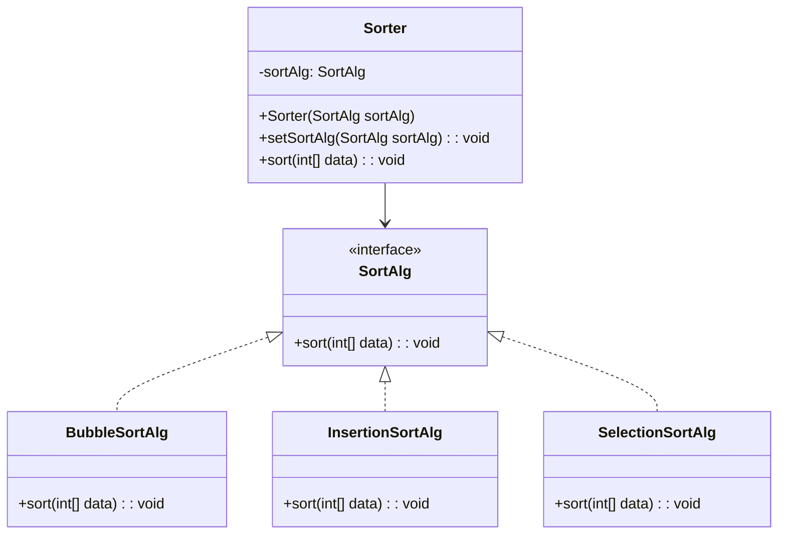

> Strategy 패턴 실습

# 실습과제 #03-2

* 정수를 정렬하는 알고리즘을 교체하는 프로그램 작성

```mermaid
classDiagram
    class Sorter {
        -sortAlg: SortAlg
        +Sorter(SortAlg sortAlg)
        +setSortAlg(SortAlg sortAlg): void
        +sort(int[] data): void
    }

    class SortAlg {
        <<interface>>
        +sort(int[] data): void
    }

    class BubbleSortAlg {
        +sort(int[] data): void
    }

    class InsertionSortAlg {
        +sort(int[] data): void
    }

    class SelectionSortAlg {
        +sort(int[] data): void
    }

    Sorter --> SortAlg
    SortAlg <|.. BubbleSortAlg
    SortAlg <|.. InsertionSortAlg
    SortAlg <|.. SelectionSortAlg
```
